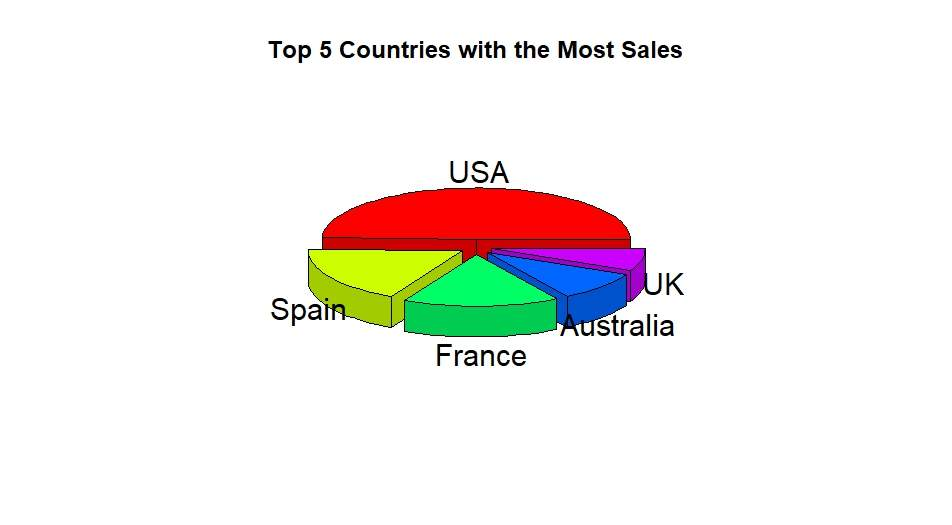
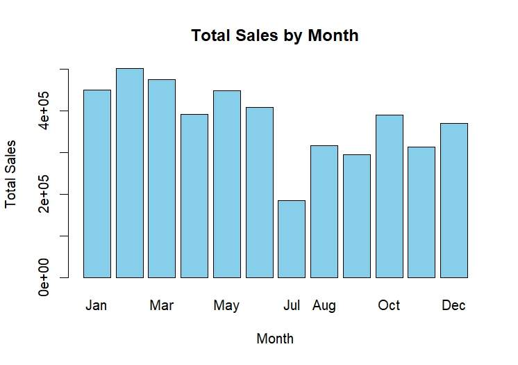

# Global Retail Market Analysis
## Overview
This project analyzes retail and advertising datasets to extract business insights, identify sales trends, and build predictive models using R Studio.
It simulates a real-world analytics scenario where a retail analytics company analyzes global sales and customer behavior to support strategic decision-making.
---
## Objectives
- Analyze global sales performance and consumption patterns
- Identify top-performing countries and product lines
- Explore relationships between economic indicators and weekly sales
- Build predictive models for sales and advertising behavior
---
## Tools & Technologies
- R
- RStudio
- dplyr
- readr
- ggplot2
- caret
- e1071
- caTools
- zoo
- plotrix
---
## Project Structure
scripts/
├── 01_data_cleaning_eda.R
├── 02_sales_trend_analysis.R
├── 03_store_sales_modeling.R
└── 04_ad_click_classification.R

## Dataset

The datasets used in this project are not included in the repository due to size or licensing restrictions.
To run the project, place the following files inside the `data/` folder:
- sales_data_sample.csv
- Features data set.csv
- sales data-set.csv
- stores data-set.csv
- advertising.csv
---

## Key Analysis

### 1. Sales Data Analysis
- Data cleaning and missing value handling
- Top countries by sales
- Monthly and yearly sales trends
- Product-level analysis
- Correlation heatmap

### 2. Store-Level Modeling
- Merging multiple datasets
- Missing value imputation (mean, median, mode)
- Feature selection
- Polynomial regression for weekly sales prediction

### 3. Advertising Click Prediction
- Logistic Regression
- Naive Bayes
- Model evaluation using confusion matrix

## Visualizations

---

## Results
- Identified key sales drivers such as price and quantity
- Found moderate correlations between sales and economic indicators
- Built predictive models for both sales and customer behavior

---

## How to Run

1. Open project in RStudio  
2. Install required packages: install.packages(c("dplyr","readr","ggplot2","caret","e1071","caTools","zoo","plotrix"))
3. Place datasets in data/ folder
4. Run scripts in order
